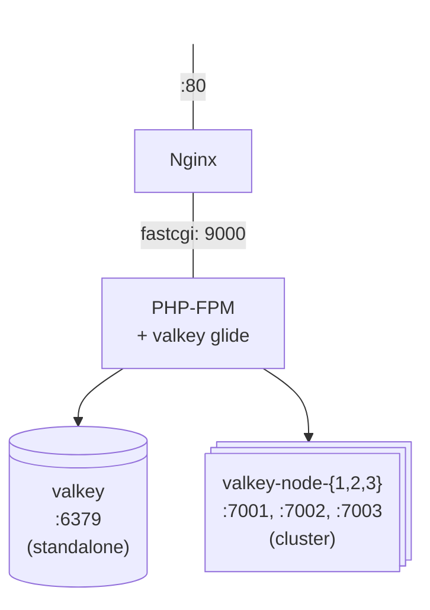

# Docker Valkey-Glide PHP

A Docker environment for developing with [valkey-glide-php](https://github.com/valkey-io/valkey-glide-php) — includes Nginx, PHP-FPM, and both standalone and cluster Valkey instances.

Valkey setup supporting both standalone and cluster modes, with configurable data persistence via bind mounts.

## Prerequisites

- Docker & Docker Compose

## Quick Start

### Standalone

```bash
git clone https://github.com/opensource-for-valkey/docker-valkey-glide.git
cd docker-valkey-glide

# First time, or after changes to the dockerfile/entrypoint
make build-standalone
 
# Start
make up-standalone
 
# Stop and remove volumes
make down-standalone
```
```

Connect with:

```bash
docker exec -it valkey valkey-cli -p 6379
```

### Cluster
 
A 3-node cluster — across ports `7001–7003`. Hash slots are distributed evenly across the 3 primaries:
 
| Node | Port | Role | Slots |
|------|------|------|-------|
| valkey-1 | 7001 | Primary | 0 – 5460 |
| valkey-2 | 7002 | Primary | 5461 – 10922 |
| valkey-3 | 7003 | Primary | 10923 – 16383 |
 
```bash
# First time, or after changes to the dockerfile/entrypoint
make build-cluster
 
# Start (initializes cluster automatically on first run)
make up-cluster
 
# Stop and remove volumes
make down-cluster
```
 
Connect with:

```bash
# The -c flag enables cluster-redirect mode
docker exec -it valkey-1 valkey-cli -c -p 7001
```

## Data Persistence
 
Persistence is enabled by default and controlled via the `PERSIST` environment variable.
 
| `PERSIST` | Behaviour |
|-----------|-----------|
| `yes` (default) | RDB snapshots + AOF log written to `data/` |
| `no` | In-memory only, nothing written to disk |
 
```bash
# With persistence (default)
make up-cluster
 
# Without persistence
PERSIST=no make up-cluster
PERSIST=no make up-standalone
```
 
When persistence is enabled, each node writes its data to a local `data/` subfolder:
 
- `dump.rdb` — RDB snapshot
- `appendonly.aof` — append-only log
- `nodes.conf` — cluster topology (cluster mode only)
Note that `nodes.conf` is always written regardless of `PERSIST` — Valkey needs it to track cluster membership and it contains no user data.
 
Data survives `docker compose down`. To fully reset, remove the `data/` folder:
 
```bash
make down-cluster
rm -rf data/
```

## Cluster Initialization
 
`init-cluster.sh` runs automatically on the first `make up-cluster` and is skipped on subsequent runs. It detects whether the cluster has already been initialized by checking for `data/valkey-1/nodes.conf`.
 
To force a re-initialization, remove the data folder and bring the cluster back up:
 
```bash
make down-cluster
rm -rf data/
make build-cluster
make up-cluster
```


## Testing

Run CLI demos:
```bash
# SSH into the container if needed
docker exec -it docker-valkey-glide-php-1 bash

# Install PHPUnit in the PHP container
docker exec docker-valkey-glide-php-1 sh -c "cd /var/www/cli/ && composer require --dev phpunit/phpunit"

# Test standalone Valkey connection
docker exec docker-valkey-glide-php-1 /var/www/cli/vendor/bin/phpunit /var/www/cli/ValkeyStandaloneTest.php
```

## Project Structure

| File | Description |
|------|-------------|
| `tests/ValkeyTestBase.php` | Abstract PHPUnit test class with all 18 test methods. |
| `tests/ValkeyStandaloneTest.php` | Standalone test implementation (extends ValkeyTestBase). |
| `php.dockerfile` | PHP 8.4 FPM with Rust toolchain and valkey-glide compiled from source. |
| `nginx.dockerfile` | Nginx stable-alpine with PHP-FPM integration. |
| `valkey.dockerfile` | Valkey 9 Alpine image. |
| `docker-compose.yml` | Full stack: Nginx, PHP-FPM, MariaDB, standalone Valkey. |
| `docker-compose.cluster.yml` | Full stack: Nginx, PHP-FPM, MariaDB, cluster Valkey. |

## Architecture



## Configuration

The valkey-glide version is configurable via build arg:

```bash
docker compose build --build-arg VALKEY_GLIDE_VERSION=1.0.0
```

## Stopping

```bash
make down-standalone
```

## Network
 
| Mode | Network name |
|------|-------------|
| Standalone | `valkey-net` |
| Cluster | `valkey-cluster` |
 
The networks are intentionally separate to avoid conflicts when running both modes on the same machine.
 
## Makefile Reference
 
| Command | Description |
|---------|-------------|
| `make build-standalone` | Build the standalone image |
| `make up-standalone` | Start standalone instance |
| `make down-standalone` | Stop standalone and remove volumes |
| `make build-cluster` | Build the cluster image |
| `make up-cluster` | Start cluster, init on first run |
| `make down-cluster` | Stop cluster and remove volumes |
 

## Notes

- The cluster uses 3 primary nodes with no replicas (suitable for local dev/testing).
- `valkey-cluster-init` is a one-shot container that creates the cluster topology and exits.
- Alpine Linux is **not** supported by valkey-glide — the Dockerfile uses Debian-based PHP.
- Requires PHP 8.1+ (8.4 used here).
