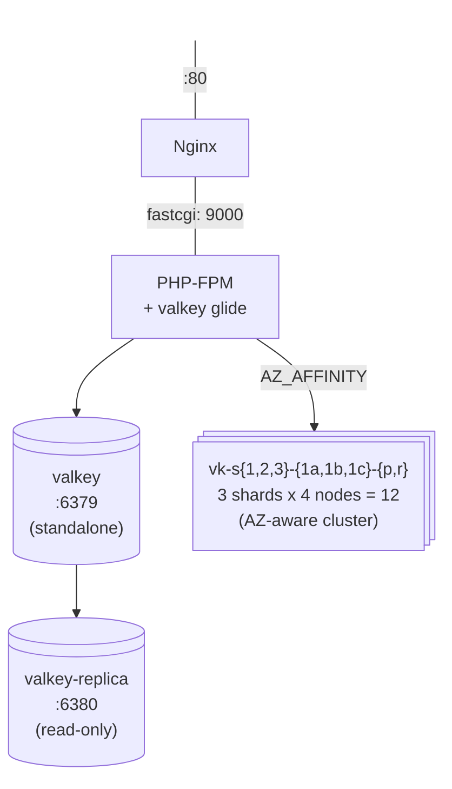

# Docker Valkey-Glide PHP

A Docker environment for developing with [valkey-glide-php](https://github.com/valkey-io/valkey-glide-php) — includes OpenResty (nginx + LuaJIT), PHP-FPM, and both standalone and cluster Valkey instances.

> The web server is [OpenResty](https://openresty.org/), configured from its own `openresty/` folder. The stock nginx image (`nginx.dockerfile` + `nginx/`) is kept for reference. To fall back to plain nginx, point the `openresty` service in `docker-compose.yml` at `nginx.dockerfile`.

## Prerequisites

- Docker & Docker Compose

## Quick Start

```bash
git clone https://github.com/opensource-for-valkey/valkey-glide-php-docker.git
cd valkey-glide-php-docker

# Build and start all services
docker compose up -d --build
```

## Scripts

Interactive helper scripts live in `scripts/` and use [gum](https://github.com/charmbracelet/gum). They require `gum`, `httpie`, `jq`, and `docker` on the host.

```bash
./scripts/setup.sh       # build + start the stack (incl. cluster), install PHPUnit
./scripts/test.sh        # run every suite (default)
./scripts/test.sh --pick # interactively choose a subset via gum
./scripts/teardown.sh    # stop and remove the stack
```

`test.sh` runs every suite by default. Pass `--pick` on a TTY to choose a subset via gum; when stdin is not a TTY, all suites always run:

| Suite | What it checks |
|-------|----------------|
| Standalone (CLI) | PHPUnit against the standalone primary. |
| Replica (CLI) | PHPUnit — writes to primary, reads back from the replica via a `PREFER_REPLICA` client. |
| Cluster (CLI) | PHPUnit — 12-node AZ-aware cluster: topology shape, per-shard one-replica-per-AZ spread, and `AZ_AFFINITY` reads served from the client's own AZ. |
| MariaDB (CLI) | PHPUnit — PHP → MariaDB connectivity via PDO (`pdo_mysql`). |
| PostgreSQL (CLI) | PHPUnit — PHP → PostgreSQL connectivity via PDO (`pdo_pgsql`). |
| SQLite (CLI) | PHPUnit — PHP → SQLite connectivity via PDO (`pdo_sqlite`). |
| Memcached (CLI) | PHPUnit — PHP → Memcached connectivity via `ext-memcached`. |
| Web server (HTTPie) | `GET http://localhost:8080/`, validates the JSON with HTTPie + `jq`. |

## Testing (manual)

Run CLI demos:
```bash
# SSH into the container if needed
docker exec -it valkey-glide-php-docker-php-1 bash

# Install PHPUnit in the PHP container
docker exec valkey-glide-php-docker-php-1 sh -c "cd /var/www/cli/ && composer require --dev phpunit/phpunit"

# Test standalone Valkey connection
docker exec valkey-glide-php-docker-php-1 /var/www/cli/vendor/bin/phpunit /var/www/cli/ValkeyStandaloneTest.php

# Test primary/replica replication
docker exec valkey-glide-php-docker-php-1 /var/www/cli/vendor/bin/phpunit /var/www/cli/ValkeyReplicaTest.php
```

Test the web endpoint:
```bash
http GET http://localhost:8080/
```

### AZ-aware cluster

The stack also runs a 12-node Valkey **cluster** that simulates ElastiCache/
MemoryDB in `us-east-1` across 3 AZs:

- **3 shards**, each with 1 primary + 3 replicas — one replica in *every* AZ
  (including the primary's own). Because every AZ holds a node for every
  shard, an AZ-affinity client always finds a local replica to read from.
- Node hostnames follow `vk-s<shard>-<az>-<p|r>` (e.g. `vk-s1-1a-p`,
  `vk-s2-1c-r`).
- Each node advertises its AZ via Valkey's `--availability-zone`. GLIDE reads
  that to route reads when connected with
  `read_from: READ_FROM_AZ_AFFINITY` + `client_az: 'us-east-1a'`.

```
Shard 1  primary=us-east-1a   replicas: 1a, 1b, 1c
Shard 2  primary=us-east-1b   replicas: 1a, 1b, 1c
Shard 3  primary=us-east-1c   replicas: 1a, 1b, 1c
```

The topology is formed by the one-shot `valkey-cluster-init` container
(`scripts/cluster-init.sh`), which creates the cluster from the 3 primaries
then attaches each replica to its shard's primary with explicit AZ placement.
The web endpoint demonstrates affinity — pin the AZ with `?az=`:

```bash
http GET http://localhost:8080/ az==us-east-1c | jq .cluster
```

## Project Structure

| File | Description |
|------|-------------|
| `tests/ValkeyTestBase.php` | Abstract PHPUnit test class with all 18 test methods. |
| `tests/ValkeyStandaloneTest.php` | Standalone test implementation (extends ValkeyTestBase). |
| `tests/ValkeyReplicaTest.php` | Replication test — writes to primary, reads from replica. |
| `tests/ValkeyClusterTest.php` | AZ-aware cluster test — topology shape + `AZ_AFFINITY` read routing. |
| `tests/DatabaseTestBase.php` | Abstract PDO connectivity test class (shared DB assertions). |
| `tests/MariaDbConnectionTest.php` | PHP → MariaDB connectivity via PDO. |
| `tests/PostgresConnectionTest.php` | PHP → PostgreSQL connectivity via PDO. |
| `tests/SqliteConnectionTest.php` | PHP → SQLite connectivity via PDO. |
| `tests/MemcachedConnectionTest.php` | PHP → Memcached connectivity via ext-memcached. |
| `web/index.php` | JSON endpoint: writes to primary, reads back via a `PREFER_REPLICA` client. |
| `scripts/setup.sh` | gum-driven build + start + PHPUnit install. |
| `scripts/test.sh` | gum-driven CLI + web test runner (HTTPie + jq validation). |
| `scripts/teardown.sh` | gum-driven stop + cleanup. |
| `openresty/default.conf` | OpenResty vhost on `:80` (Laravel public root). |
| `openresty/web.conf` | OpenResty vhost on `:8080` serving `web/`. |
| `nginx/default.conf` | Stock nginx vhost on `:80` — kept for reference. |
| `nginx/web.conf` | Stock nginx vhost on `:8080` — kept for reference. |
| `php.dockerfile` | PHP 8.4 FPM with Rust toolchain and valkey-glide compiled from source. |
| `openresty.dockerfile` | OpenResty (nginx + LuaJIT) — the web server in use. |
| `nginx.dockerfile` | Stock Nginx stable-alpine — kept for reference. |
| `valkey.dockerfile` | Valkey 9 Alpine image (standalone primary + replica). |
| `valkey-cluster.dockerfile` | Valkey 9 cluster node; advertises its AZ via `--availability-zone` (`VALKEY_AZ`). |
| `scripts/cluster-init.sh` | One-shot: forms the 12-node cluster with explicit replica→primary+AZ placement. |
| `docker-compose.yml` | Full stack: OpenResty, PHP-FPM, MariaDB, PostgreSQL, Memcached, standalone Valkey + replica, and the 12-node AZ-aware cluster. |

## Architecture



## Configuration

The valkey-glide version is configurable via build arg:

```bash
docker compose build --build-arg VALKEY_GLIDE_VERSION=1.0.0
```

## Stopping

```bash
docker compose down
```

## Notes

- The cluster uses 3 shards, each with 1 primary + 3 replicas (one per AZ) = 12 nodes, simulating a Multi-AZ ElastiCache/MemoryDB deployment in `us-east-1`.
- `valkey-cluster-init` is a one-shot container that creates the cluster topology and exits.
- Cluster nodes are internal to the compose network (no host port mappings); inspect them via `docker compose exec vk-s1-1a-p valkey-cli -c ...`.
- Alpine Linux is **not** supported by valkey-glide — the Dockerfile uses Debian-based PHP.
- Requires PHP 8.1+ (8.4 used here).
